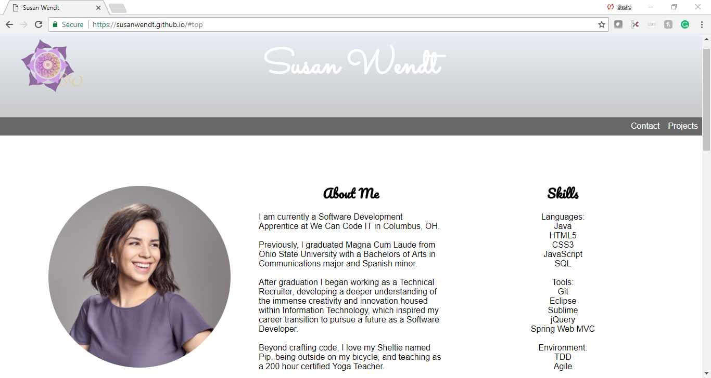

Professional Portfolio V2 with JS Overview

Upgraded professional portfolio to include JS content (no frameworks) and meet all previous requirements. 

Tasks
- [ ] All requirements from iteration one of this project should still be there. You are encouraged to make a multi page site this time around.

Additions to your site
- [ ] Add an image carousel. This can be a carousel of screenshots of your projects (perhaps they link to your projects)
- [ ] Add a button in your navigation that will toggle the visibility of your actual site navigation.
- [ ] Add a button and collapsable description to your portfolio projects so when the user clicks the button the descriptions expand and collapse
- [ ] Create a modal box that pops up with your bio information whenever a button or link is pressed

Stretch Goals
- [ ] Change layout with media queries based on viewport width. Feel free to use other specific media rules but base media queries should be based on viewport width. (Most common)
- [ ] Have the dropdown navigation menu only when at smaller viewports and the full navigation when at larger viewports

Rubric

Category | Max Score
-------- | ---------	
All previous requirements met | x/10
Proper variable names and variable keywords	| x/10
Properly declared event listeners | x/10
Proper function declaration | x/10
Image carousel | x/10
Navigation menu button | x/10
Collapsable descriptions | x/10
Modal box for bio information | x/10
TDD | x/10
Style, Formatting, and Code Quality | x/10 
