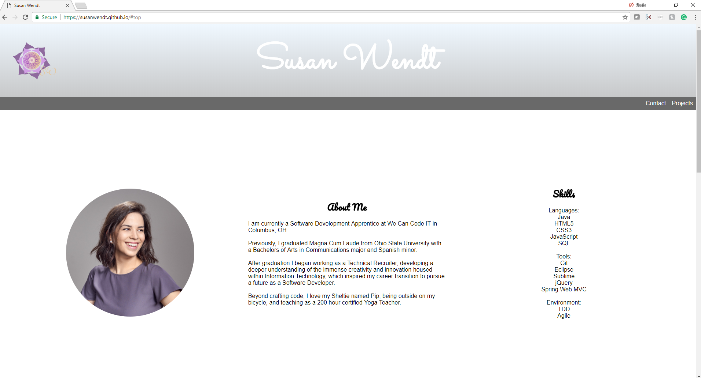

Professional Portfolio Overview

Create a portfolio site highlighting your work that can be shared with potential employers. Focus first on building a good structure, then later style and lay out with with CSS.

Tasks
[X] First, set up your username.github.io site as per the instructions at https://pages.github.com.

Build the document structure
[X] Create a main page (index.html) representing a professional portfolio, including the following:
	[X] an appropriate header element
	[X] a nav element linking to each of the sections
	[X] an h1 element with your page title (there can be only one)
	[X] a section element for each of the following, each of which should contain an appropriate heading element:
		[X] About Me, consisting of:
			[X] brief biographical information
			[X] photo
			[X] contact information
			[X] links to your professional networking site profiles, including at least GitHub and LinkedIn
			[X] list of skills
			[] Include whatever other information you consider pertinent.
		[X] Projects, consisting of at least three, each represented as an article
			[X] name of project, linked to GitHub repository or the repository/project’s GitHub Pages screenshot
			[X] skills / technologies used
	[X] an appropriate footer element

Lay out and style your portfolio
	[X] Assign ids/classes to sections/etc, then use css grid to lay out your page. 
	[X] To contain the elements of your grid, you will want to create a div, something like div id="container".../div.
	[X] Create CSS rules to style page elements appropriately.

Using online resources
	Any resources (images, etc) you use should be:
		[X] free for non-commercial use
		[X] copied to your repository and referenced there rather than via a uri pointing to another site

Rubric
[x/10] project hosted on username.github.io
[x/10] index.html
[x/8] header element
[x/7] nav element
[x/10] use of Grid and Flexbox and not a framework
[x/7] section elements
[x/8] headings h1, h2 etc…
[x/7] About Me Section
[x/7] 3 Projects contained in article tags
[x/8] footer
[x/8] appropriate images for content
[x/10] style/formatting/code quality